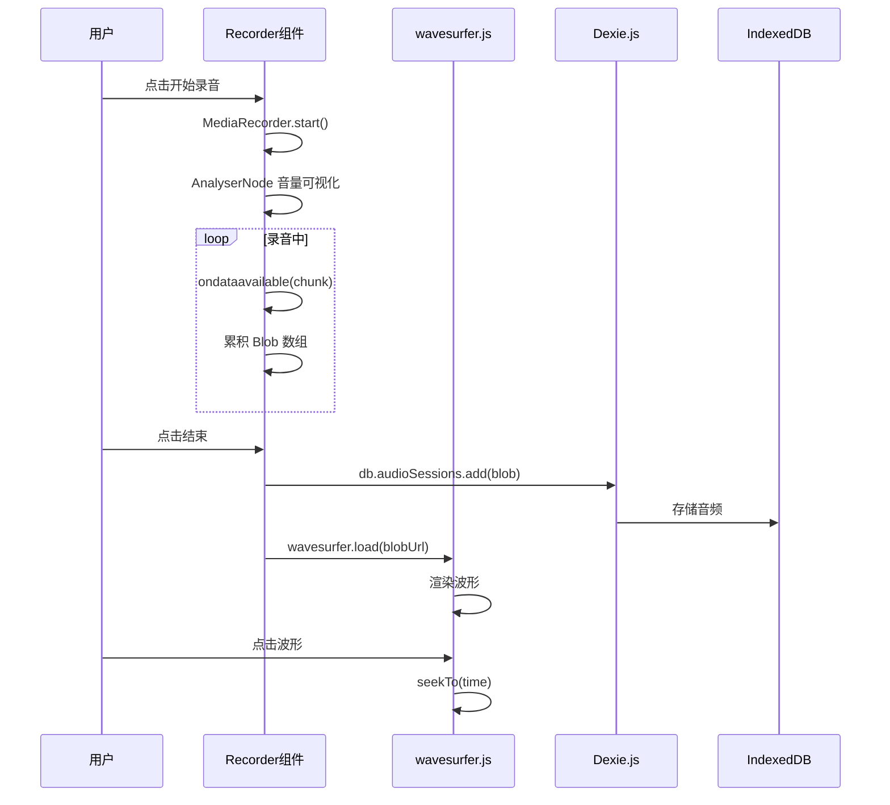
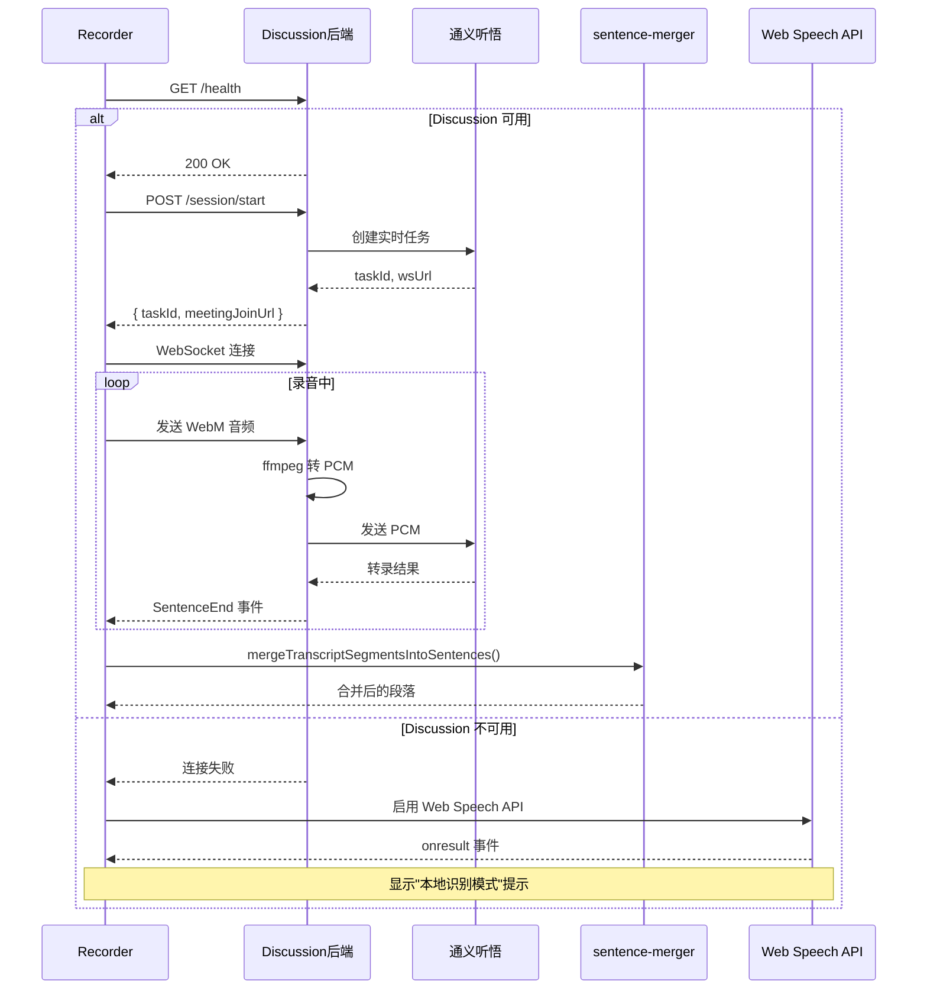
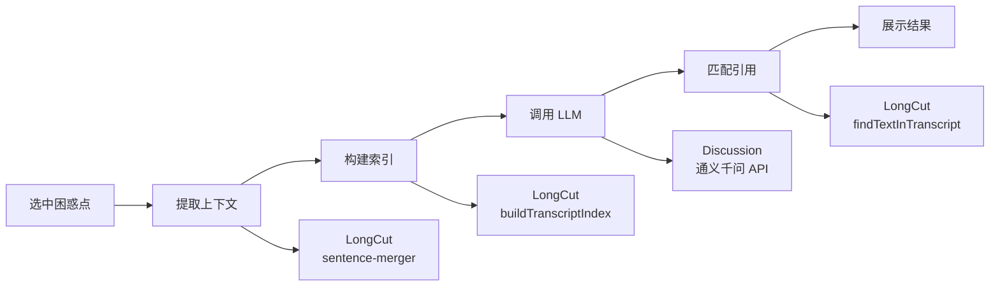
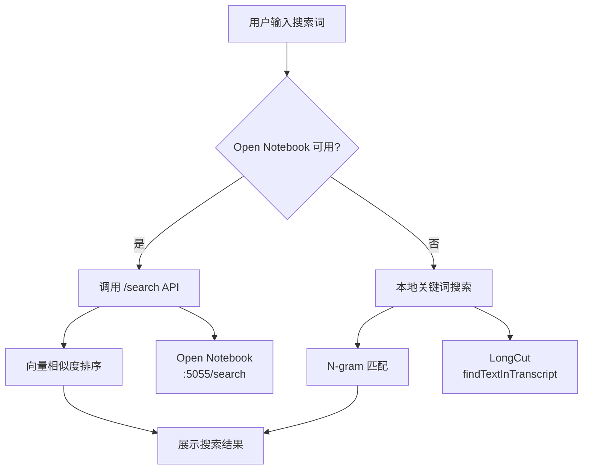
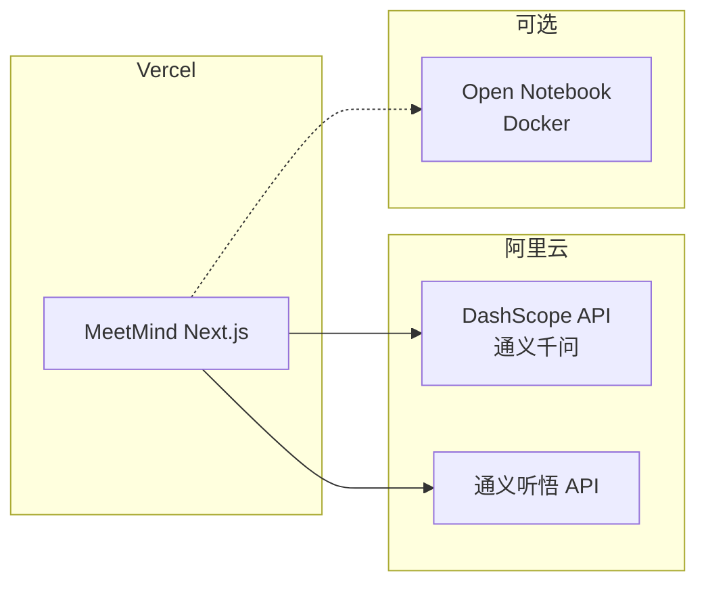

# 技术方案设计：MeetMind MVP

## 设计原则

### 1. 复用优先，降低设计熵

```
设计熵 = 自研代码量 × 维护复杂度 × 技术债务风险

最小化设计熵的方法：
1. 自研代码量 → 最小化（仅写业务编排层）
2. 维护复杂度 → 委托给成熟开源项目
3. 技术债务风险 → 使用高 star 项目降低
```

**核心策略：**
- **能复用就不自研** - 优先使用成熟开源项目的能力
- **能调用就不封装** - 直接使用开源库 API，不过度抽象
- **能标准化就不定制** - 遵循 OpenAI 兼容格式等行业标准

**软件开发基本原则遵循：**
- **KISS (Keep It Simple, Stupid)** - 使用开源组件的最简单 API
- **DRY (Don't Repeat Yourself)** - 复用已有代码，不重复造轮子
- **YAGNI (You Aren't Gonna Need It)** - 只集成需要的功能
- **单一职责** - 每个服务只做一件事
- **依赖倒置** - 业务层依赖抽象，具体实现由开源组件提供

### 2. 能力来源分层

```
┌─────────────────────────────────────────────────────────────┐
│                    MeetMind 业务层                           │
│  (困惑点管理、家长端、教师端 - 唯一需要自研的部分)              │
├─────────────────────────────────────────────────────────────┤
│                    开源项目复用层                            │
│  ┌─────────────┐ ┌─────────────┐ ┌─────────────┐           │
│  │ Discussion  │ │   LongCut   │ │Open Notebook│           │
│  │ 通义听悟    │ │ 算法工具    │ │ 向量搜索    │           │
│  │ 通义千问    │ │ 引用匹配    │ │ 知识管理    │           │
│  └─────────────┘ └─────────────┘ └─────────────┘           │
├─────────────────────────────────────────────────────────────┤
│                    开源组件层                                │
│  wavesurfer.js │ Dexie.js │ @nivo/heatmap │ Web Speech API       │
├─────────────────────────────────────────────────────────────┤
│                    基础设施层                                │
│  Next.js 14 │ Tailwind CSS │ TypeScript │ IndexedDB         │
└─────────────────────────────────────────────────────────────┘
```

---

## 1. 系统架构

### 1.1 整体架构图

```mermaid
graph TB
    subgraph 客户端 [MeetMind Next.js :3001]
        A[学生端 /]
        B[家长端 /parent]
        C[教师端 /teacher]
        
        subgraph 复用组件
            WS[wavesurfer.js<br/>音频波形播放]
            DX[Dexie.js<br/>IndexedDB 封装]
            RC[@nivo/heatmap<br/>热力图可视化]
        end
        
        subgraph 复用算法 [从 LongCut 复制]
            QM[quote-matcher.ts<br/>引用匹配]
            SM[sentence-merger.ts<br/>句子合并]
            TU[timestamp-utils.ts<br/>时间戳工具]
        end
    end
    
    subgraph 外部服务
        subgraph Discussion [:4000]
            D1[通义听悟 WebSocket]
            D2[通义千问 API]
        end
        
        subgraph OpenNotebook [:5055]
            N1[向量搜索 /search]
            N2[嵌入生成 /embedding]
        end
    end
    
    subgraph 降级方案
        WSA[Web Speech API<br/>浏览器原生]
        LKS[本地关键词搜索<br/>quote-matcher]
    end
    
    A --> D1
    A --> D2
    A --> N1
    A -.-> WSA
    A -.-> LKS
    
    B --> DX
    C --> RC
```

### 1.2 技术栈

| 层级 | 技术选型 | 来源 | 说明 |
|------|----------|------|------|
| 前端框架 | Next.js 14 (App Router) | 标准 | React 服务端组件 |
| UI 样式 | Tailwind CSS | 标准 | 原子化 CSS |
| 音频播放 | wavesurfer.js | 开源 (10k stars) | 波形可视化 + 播放器 |
| 本地存储 | Dexie.js | 开源 (13.9k stars) | IndexedDB 简化 API |
| 热力图可视化 | @nivo/heatmap | 开源 (13.9k stars) | 专业热力图组件 |
| AI 聊天 UI | Vercel AI SDK | 开源 (20.6k stars) | useChat Hook + 流式输出 |
| 语音转录 | Discussion 后端 | 复用 | 通义听悟代理 |
| LLM 调用 | Discussion 后端 | 复用 | OpenAI 兼容 API |
| 向量搜索 | Open Notebook | 复用 | /search API |
| 引用匹配 | LongCut | 复制 | quote-matcher.ts |
| 句子合并 | LongCut | 复制 | transcript-sentence-merger.ts |
| 主题提取 | LongCut | 复制 | topic-utils.ts |

### 1.3 复用项目能力详情

#### Discussion 项目 (100% 复用)

| 能力 | 文件位置 | 调用方式 | 降级方案 |
|------|----------|----------|----------|
| 通义听悟实时转写 | tingwu.service.ts | WebSocket | Web Speech API |
| 音频格式转换 | audio-relay.service.ts | 透明代理 | 无需降级 |
| 通义千问 LLM | llm-adapter.service.ts | OpenAI 兼容 API | 无（必须） |

**调用示例（基于实际 API）：**
```typescript
// 创建实时转写任务
const response = await fetch('http://localhost:4000/sessions', {
  method: 'POST',
  headers: { 'Content-Type': 'application/json' },
  body: JSON.stringify({ meetingId: sessionId, topic: '数学课' })
});
const { sessionId, taskId, meetingJoinUrl } = await response.json();

// WebSocket 连接（通过 audio-relay）
const ws = new WebSocket(meetingJoinUrl);
ws.onmessage = (event) => {
  const msg = JSON.parse(event.data);
  if (msg.header?.name === 'SentenceEnd') {
    // 处理最终转录结果
    onTranscript(msg.payload.result);
  }
};

// AI 问答
const qaResponse = await fetch(`http://localhost:4000/sessions/${sessionId}/qa`, {
  method: 'POST',
  headers: { 'Content-Type': 'application/json' },
  body: JSON.stringify({ question: '这个公式怎么理解？' })
});
```

#### LongCut 项目 (直接复制文件)

| 文件 | 用途 | 复制到 |
|------|------|--------|
| lib/quote-matcher.ts | 引用匹配算法 | src/lib/longcut/quote-matcher.ts |
| lib/transcript-sentence-merger.ts | 句子合并 | src/lib/longcut/sentence-merger.ts |
| lib/timestamp-utils.ts | 时间戳格式化 | src/lib/longcut/timestamp-utils.ts |
| lib/topic-utils.ts | 主题提取水合 | src/lib/longcut/topic-utils.ts |
| lib/types.ts | 类型定义 | src/lib/longcut/types.ts |

**复制后的目录结构：**
```
src/lib/longcut/
├── quote-matcher.ts      # 引用匹配（Boyer-Moore + N-gram）
├── sentence-merger.ts    # 句子合并（标点检测 + 长度限制）
├── timestamp-utils.ts    # 时间戳格式化
├── topic-utils.ts        # 主题提取与水合
├── types.ts              # 类型定义
└── index.ts              # 统一导出
```

#### Open Notebook 项目 (HTTP API 调用)

| API | 用途 | 请求格式 |
|-----|------|----------|
| POST /search | 向量搜索 | `{ query: string, notebook_id?: string }` |
| GET /health | 健康检查 | 无参数 |

**调用示例：**
```typescript
// 向量搜索
const response = await fetch('http://localhost:5055/search', {
  method: 'POST',
  headers: { 'Content-Type': 'application/json' },
  body: JSON.stringify({ query: '二次函数顶点式' })
});
const results = await response.json();
// results: [{ content, score, source, metadata }]
```

---

## 2. 核心模块设计

### 2.1 录音与回放模块

**复用组件：**
- wavesurfer.js - 音频波形可视化和播放
- Dexie.js - 音频存储到 IndexedDB
- Web Audio API - 实时音量可视化



**Dexie.js 数据库设计：**

```typescript
// src/lib/db.ts
import Dexie, { Table } from 'dexie';

export interface AudioSession {
  id?: number;
  sessionId: string;
  blob: Blob;
  mimeType: string;
  duration: number;
  status: 'recording' | 'completed' | 'archived';
  createdAt: Date;
  updatedAt: Date;
}

export interface Anchor {
  id?: number;
  sessionId: string;
  timestamp: number;
  type: 'confusion' | 'important';
  status: 'active' | 'resolved';
  note?: string;
  createdAt: Date;
  resolvedAt?: Date;
}

export interface TranscriptSegment {
  id?: number;
  sessionId: string;
  text: string;
  startMs: number;
  endMs: number;
  speakerId?: string;
  confidence: number;
  isFinal: boolean;
}

class MeetMindDB extends Dexie {
  audioSessions!: Table<AudioSession>;
  anchors!: Table<Anchor>;
  transcripts!: Table<TranscriptSegment>;

  constructor() {
    super('MeetMindDB');
    this.version(1).stores({
      audioSessions: '++id, sessionId, status, createdAt',
      anchors: '++id, sessionId, timestamp, status',
      transcripts: '++id, sessionId, startMs'
    });
  }
}

export const db = new MeetMindDB();
```

**Dexie.js + React 集成（useLiveQuery）：**

```typescript
// src/hooks/useAnchors.ts
import { useLiveQuery } from 'dexie-react-hooks';
import { db } from '../lib/db';

// ✅ 最佳实践：使用 useLiveQuery 实现响应式数据
export function useAnchors(sessionId: string) {
  // 自动响应数据变化，无需手动刷新
  const anchors = useLiveQuery(
    () => db.anchors.where('sessionId').equals(sessionId).toArray(),
    [sessionId] // 依赖数组：sessionId 变化时重新查询
  );
  
  // 初始加载时可能为 undefined
  return anchors ?? [];
}

// 使用示例
function AnchorList({ sessionId }) {
  const anchors = useAnchors(sessionId);
  
  return (
    <ul>
      {anchors.map(anchor => (
        <li key={anchor.id}>{formatTimestamp(anchor.timestamp)}</li>
      ))}
    </ul>
  );
}
```

**wavesurfer.js 集成（完整 React Hook）：**

```typescript
// src/components/AudioPlayer.tsx
import { useEffect, useRef, useCallback } from 'react';
import WaveSurfer from 'wavesurfer.js';
import RegionsPlugin from 'wavesurfer.js/plugins/regions';

interface AudioPlayerProps {
  audioUrl: string;
  anchors: Anchor[];
  onSeek?: (time: number) => void;
  onReady?: () => void;
}

const AudioPlayer = ({ audioUrl, anchors, onSeek, onReady }: AudioPlayerProps) => {
  const containerRef = useRef<HTMLDivElement>(null);
  const wavesurferRef = useRef<WaveSurfer | null>(null);

  useEffect(() => {
    if (!containerRef.current) return;

    // ✅ 最佳实践：在 useEffect 中创建实例
    const ws = WaveSurfer.create({
      container: containerRef.current,
      waveColor: '#4F46E5',
      progressColor: '#818CF8',
      cursorColor: '#EF4444',
      height: 80,
      barWidth: 2,
      barGap: 1,
      barRadius: 2,
      plugins: [RegionsPlugin.create()]
    });

    ws.load(audioUrl);

    // 添加困惑点标记
    ws.on('ready', () => {
      anchors.forEach(anchor => {
        ws.plugins.regions.addRegion({
          start: anchor.timestamp / 1000,
          end: (anchor.timestamp + 5000) / 1000,
          color: anchor.status === 'resolved' 
            ? 'rgba(34, 197, 94, 0.3)' 
            : 'rgba(239, 68, 68, 0.3)',
          drag: false,
          resize: false
        });
      });
      onReady?.();
    });

    // 点击波形跳转
    ws.on('interaction', () => {
      ws.play();
    });

    ws.on('timeupdate', (time) => {
      onSeek?.(time);
    });

    wavesurferRef.current = ws;
    
    // ✅ 关键：组件卸载时必须销毁实例
    return () => ws.destroy();
  }, [audioUrl]); // 仅在 audioUrl 变化时重建

  // 暴露控制方法
  const seekTo = useCallback((time: number) => {
    wavesurferRef.current?.seekTo(time / wavesurferRef.current.getDuration());
  }, []);

  const playPause = useCallback(() => {
    wavesurferRef.current?.playPause();
  }, []);

  return (
    <div className="w-full">
      <div ref={containerRef} className="rounded-lg overflow-hidden" />
      <div className="flex gap-2 mt-2">
        <button onClick={playPause} className="px-4 py-2 bg-indigo-600 text-white rounded">
          播放/暂停
        </button>
      </div>
    </div>
  );
};
```

### 2.2 语音转录模块

**复用能力：**
- Discussion 后端 - 通义听悟 WebSocket
- LongCut sentence-merger.ts - 句子合并
- Web Speech API - 降级方案



**服务接口设计：**

```typescript
// src/lib/services/transcription-service.ts
import { TingwuClient } from './tingwu-service';
import { SpeechService } from './speech-service';
import { mergeTranscriptSegmentsIntoSentences } from '../longcut/sentence-merger';
import { db, TranscriptSegment } from '../db';

export class TranscriptionService {
  private tingwuClient: TingwuClient | null = null;
  private speechService: SpeechService | null = null;
  private mode: 'tingwu' | 'webspeech' | 'none' = 'none';

  async initialize(sessionId: string, callbacks: TranscriptionCallbacks) {
    // 尝试 Discussion 后端
    const isAvailable = await TingwuClient.isAvailable();
    
    if (isAvailable) {
      this.tingwuClient = new TingwuClient(sessionId, {
        onTranscript: async (segment) => {
          await db.transcripts.add({ sessionId, ...segment });
          callbacks.onTranscript(segment);
        },
        onInterim: callbacks.onInterim,
        onError: callbacks.onError
      });
      await this.tingwuClient.createTask();
      await this.tingwuClient.connect();
      this.mode = 'tingwu';
    } else {
      // 降级到 Web Speech API
      this.speechService = new SpeechService(callbacks);
      this.speechService.start();
      this.mode = 'webspeech';
      callbacks.onModeChange?.('webspeech');
    }
  }

  sendAudio(data: Blob) {
    if (this.mode === 'tingwu' && this.tingwuClient) {
      this.tingwuClient.sendAudio(data);
    }
    // Web Speech API 不需要发送音频，它直接监听麦克风
  }

  async stop(): Promise<MergedSentence[]> {
    if (this.tingwuClient) {
      await this.tingwuClient.stop();
    }
    if (this.speechService) {
      this.speechService.stop();
    }

    // 获取所有转录并合并
    const segments = await db.transcripts.where('sessionId').equals(this.sessionId).toArray();
    return mergeTranscriptSegmentsIntoSentences(segments);
  }
}
```

### 2.3 AI 家教模块

**复用能力：**
- Discussion 通义千问 API - LLM 调用
- LongCut quote-matcher.ts - 引用匹配
- LongCut sentence-merger.ts - 上下文提取



**引用匹配集成：**

```typescript
// src/lib/services/tutor-service.ts
import { 
  buildTranscriptIndex, 
  findTextInTranscript 
} from '../longcut/quote-matcher';
import { chat } from './llm-service';

export async function generateExplanation(
  anchorTimestamp: number,
  segments: TranscriptSegment[],
  modelId: string = 'qwen3-max'
) {
  // 1. 提取上下文（前60秒，后30秒）
  const contextSegments = segments.filter(s => 
    s.startMs >= anchorTimestamp - 60000 &&
    s.endMs <= anchorTimestamp + 30000
  );

  // 2. 构建索引（LongCut）
  const index = buildTranscriptIndex(contextSegments);

  // 3. 调用 LLM
  const prompt = buildTutorPrompt(contextSegments, anchorTimestamp);
  const response = await chat([
    { role: 'system', content: TUTOR_SYSTEM_PROMPT },
    { role: 'user', content: prompt }
  ], modelId);

  // 4. 匹配引用（LongCut）
  const citations = extractCitations(response.content);
  const matchedCitations = citations.map(citation => {
    const match = findTextInTranscript(contextSegments, citation.text, index);
    return {
      ...citation,
      startMs: match?.found ? contextSegments[match.startSegmentIdx].startMs : null,
      endMs: match?.found ? contextSegments[match.endSegmentIdx].endMs : null,
      confidence: match?.confidence ?? 0
    };
  });

  return {
    content: response.content,
    citations: matchedCitations,
    model: modelId,
    usage: response.usage
  };
}
```

**Vercel AI SDK 聊天集成（useChat Hook）：**

```typescript
// src/components/AITutor.tsx
'use client';

import { useChat } from '@ai-sdk/react';
import { DefaultChatTransport } from 'ai';
import { useState } from 'react';

interface AITutorProps {
  anchorId: string;
  contextSegments: TranscriptSegment[];
}

export function AITutor({ anchorId, contextSegments }: AITutorProps) {
  const [input, setInput] = useState('');
  
  // ✅ 最佳实践：使用 useChat 管理聊天状态
  const { messages, sendMessage, status, stop, error, reload } = useChat({
    transport: new DefaultChatTransport({
      api: '/api/chat',
      body: { anchorId, context: contextSegments }, // 传递上下文
    }),
  });

  return (
    <div className="flex flex-col h-full">
      {/* 消息列表 */}
      <div className="flex-1 overflow-y-auto p-4 space-y-4">
        {messages.map(message => (
          <div 
            key={message.id}
            className={`p-3 rounded-lg ${
              message.role === 'user' ? 'bg-blue-100 ml-auto' : 'bg-gray-100'
            }`}
          >
            {/* ✅ 使用 parts 渲染消息内容 */}
            {message.parts.map((part, index) =>
              part.type === 'text' ? (
                <span key={index}>{part.text}</span>
              ) : null
            )}
          </div>
        ))}
        
        {/* 加载状态 */}
        {status === 'submitted' && <div className="text-gray-500">思考中...</div>}
        {status === 'streaming' && (
          <button onClick={stop} className="text-red-500">停止生成</button>
        )}
      </div>

      {/* 错误处理 */}
      {error && (
        <div className="p-2 bg-red-100 text-red-700">
          发生错误 <button onClick={reload}>重试</button>
        </div>
      )}

      {/* 输入框 */}
      <form
        onSubmit={e => {
          e.preventDefault();
          if (input.trim() && status === 'ready') {
            sendMessage({ text: input });
            setInput('');
          }
        }}
        className="p-4 border-t"
      >
        <div className="flex gap-2">
          <input
            value={input}
            onChange={e => setInput(e.target.value)}
            disabled={status !== 'ready'}
            placeholder="追问老师讲的内容..."
            className="flex-1 px-4 py-2 border rounded"
          />
          <button 
            type="submit" 
            disabled={status !== 'ready'}
            className="px-4 py-2 bg-indigo-600 text-white rounded disabled:opacity-50"
          >
            发送
          </button>
        </div>
      </form>
    </div>
  );
}
```

**后端 API 路由（流式输出）：**

```typescript
// src/app/api/chat/route.ts
import { convertToModelMessages, streamText, UIMessage } from 'ai';

export const maxDuration = 30; // 允许流式响应最长 30 秒

export async function POST(req: Request) {
  const { messages, anchorId, context }: { 
    messages: UIMessage[]; 
    anchorId: string;
    context: TranscriptSegment[];
  } = await req.json();

  // 构建系统提示词
  const systemPrompt = buildTutorSystemPrompt(context);

  const result = streamText({
    model: 'qwen/qwen3-max', // 或其他 OpenAI 兼容模型
    system: systemPrompt,
    messages: await convertToModelMessages(messages),
  });

  return result.toUIMessageStreamResponse();
}
```

### 2.4 知识库搜索模块

**复用能力：**
- Open Notebook /search API - 向量搜索
- LongCut quote-matcher.ts - 降级本地搜索



**服务接口设计：**

```typescript
// src/lib/services/search-service.ts
import { findTextInTranscript, buildTranscriptIndex } from '../longcut/quote-matcher';

const NOTEBOOK_API = process.env.NEXT_PUBLIC_NOTEBOOK_API || 'http://localhost:5055';

export async function search(
  query: string,
  segments?: TranscriptSegment[]
): Promise<SearchResult[]> {
  // 尝试 Open Notebook 向量搜索
  try {
    const response = await fetch(`${NOTEBOOK_API}/search`, {
      method: 'POST',
      headers: { 'Content-Type': 'application/json' },
      body: JSON.stringify({ query }),
      signal: AbortSignal.timeout(3000)
    });

    if (response.ok) {
      const data = await response.json();
      return data.results.map(r => ({
        content: r.content,
        score: r.score,
        source: r.source,
        timestamp: r.metadata?.timestamp
      }));
    }
  } catch (error) {
    console.warn('Open Notebook unavailable, falling back to local search');
  }

  // 降级：本地关键词搜索
  if (segments && segments.length > 0) {
    const index = buildTranscriptIndex(segments);
    const match = findTextInTranscript(segments, query, index, {
      strategy: 'fuzzy',
      minSimilarity: 0.5
    });

    if (match?.found) {
      const matchedSegments = segments.slice(match.startSegmentIdx, match.endSegmentIdx + 1);
      return [{
        content: matchedSegments.map(s => s.text).join(' '),
        score: match.similarity,
        source: 'local',
        timestamp: matchedSegments[0].startMs
      }];
    }
  }

  return [];
}
```

---

## 3. 数据库设计

### 3.1 Dexie.js 表结构

```typescript
// 完整的数据库 Schema
db.version(1).stores({
  // 音频会话
  audioSessions: '++id, sessionId, status, createdAt',
  
  // 困惑点
  anchors: '++id, sessionId, timestamp, status, type',
  
  // 转录片段
  transcripts: '++id, sessionId, startMs, isFinal',
  
  // 用户偏好
  preferences: 'key'
});
```

### 3.2 数据模型

```typescript
// 音频会话
interface AudioSession {
  id?: number;
  sessionId: string;           // UUID
  blob: Blob;                  // 音频数据
  mimeType: string;            // 'audio/webm'
  duration: number;            // 毫秒
  subject?: string;            // 学科
  topic?: string;              // 主题
  status: 'recording' | 'completed' | 'archived';
  createdAt: Date;
  updatedAt: Date;
}

// 困惑点
interface Anchor {
  id?: number;
  sessionId: string;
  timestamp: number;           // 毫秒
  type: 'confusion' | 'important' | 'question';
  status: 'active' | 'resolved';
  note?: string;
  aiExplanation?: string;      // AI 生成的解释
  createdAt: Date;
  resolvedAt?: Date;
}

// 转录片段
interface TranscriptSegment {
  id?: number;
  sessionId: string;
  text: string;
  startMs: number;
  endMs: number;
  speakerId?: string;
  confidence: number;
  isFinal: boolean;
}
```

### 2.5 教师端热力图模块

**复用能力：**
- @nivo/heatmap - 专业热力图组件
- LongCut topic-utils.ts - 主题提取

**@nivo/heatmap 集成（完整示例）：**

```typescript
// src/components/ConfusionHeatmap.tsx
import { ResponsiveHeatMap } from '@nivo/heatmap';
import { useMemo } from 'react';

interface ConfusionData {
  timeSlot: string;  // '09:00-09:10'
  density: number;   // 困惑密度 0-100
  count: number;     // 困惑人数
}

interface ConfusionHeatmapProps {
  data: ConfusionData[];
  onCellClick?: (timeSlot: string) => void;
}

export function ConfusionHeatmap({ data, onCellClick }: ConfusionHeatmapProps) {
  // ✅ 关键：转换为 nivo 要求的数据格式
  const nivoData = useMemo(() => {
    return data.map(item => ({
      id: item.timeSlot,
      data: [{
        x: '困惑密度',
        y: item.density,
      }]
    }));
  }, [data]);

  return (
    <div style={{ height: 400 }}>
      <ResponsiveHeatMap
        data={nivoData}
        margin={{ top: 60, right: 90, bottom: 60, left: 90 }}
        valueFormat=">-.0f"
        axisTop={{
          tickSize: 5,
          tickPadding: 5,
          tickRotation: -45,
          legend: '时间段',
          legendOffset: 46
        }}
        axisLeft={{
          tickSize: 5,
          tickPadding: 5,
          legend: '困惑密度',
          legendPosition: 'middle',
          legendOffset: -72
        }}
        colors={{
          type: 'sequential',
          scheme: 'reds'  // 红色渐变表示困惑程度
        }}
        emptyColor="#f5f5f5"
        onClick={(cell) => {
          onCellClick?.(cell.serieId as string);
        }}
        hoverTarget="cell"
        animate={true}
        motionConfig="gentle"
        legends={[
          {
            anchor: 'bottom',
            translateX: 0,
            translateY: 30,
            length: 400,
            thickness: 8,
            direction: 'row',
            tickPosition: 'after',
            tickSize: 3,
            tickSpacing: 4,
            tickOverlap: false,
            title: '困惑密度 →',
            titleAlign: 'start',
            titleOffset: 4
          }
        ]}
      />
    </div>
  );
}
```

**数据处理（使用 LongCut topic-utils）：**

```typescript
// src/lib/services/teacher-service.ts
import { hydrateTopicsWithTranscript } from '../longcut/topic-utils';

export function aggregateConfusionData(
  anchors: Anchor[],
  segments: TranscriptSegment[],
  intervalMinutes: number = 10
): ConfusionData[] {
  // 按时间段分组
  const grouped = new Map<string, Anchor[]>();
  
  anchors.forEach(anchor => {
    const minutes = Math.floor(anchor.timestamp / 60000);
    const slot = Math.floor(minutes / intervalMinutes) * intervalMinutes;
    const key = `${String(slot).padStart(2, '0')}:00-${String(slot + intervalMinutes).padStart(2, '0')}:00`;
    
    if (!grouped.has(key)) grouped.set(key, []);
    grouped.get(key)!.push(anchor);
  });

  // 计算每个时间段的困惑密度
  return Array.from(grouped.entries()).map(([timeSlot, anchorsInSlot]) => ({
    timeSlot,
    density: Math.min(100, anchorsInSlot.length * 10), // 归一化到 0-100
    count: anchorsInSlot.length
  }));
}

export async function getTopConfusionPoints(
  anchors: Anchor[],
  segments: TranscriptSegment[],
  topN: number = 5
) {
  // ✅ 使用 LongCut 的主题提取能力
  const topics = await hydrateTopicsWithTranscript(
    anchors.map(a => ({ timestamp: a.timestamp, text: '' })),
    segments
  );

  return topics
    .sort((a, b) => b.count - a.count)
    .slice(0, topN);
}
```

---

## 4. API 路由设计

| 路由 | 方法 | 功能 | 复用来源 |
|------|------|------|----------|
| `/api/chat` | POST | AI 对话 | Discussion LLM |
| `/api/chat` | GET | 获取模型列表 | 本地配置 |
| `/api/tutor` | POST | AI 家教解释 | Discussion LLM + LongCut |
| `/api/search` | POST | 知识库搜索 | Open Notebook |
| `/api/health` | GET | 服务状态检查 | 本地 + 外部 |

---

## 5. 降级策略

| 服务 | 主方案 | 降级方案 | 检测方式 |
|------|--------|----------|----------|
| 语音转录 | Discussion 通义听悟 | Web Speech API | /health 检查 |
| LLM 调用 | Discussion 通义千问 | 无（必须） | /health 检查 |
| 向量搜索 | Open Notebook | LongCut 本地搜索 | /health 检查 |
| 音频存储 | Dexie.js IndexedDB | 无（必须） | 浏览器支持检测 |

**降级检测流程：**

```typescript
// src/lib/services/health-check.ts
export async function checkServices(): Promise<ServiceStatus> {
  const [discussionOk, notebookOk] = await Promise.all([
    fetch('http://localhost:4000/health', { signal: AbortSignal.timeout(3000) })
      .then(r => r.ok)
      .catch(() => false),
    fetch('http://localhost:5055/health', { signal: AbortSignal.timeout(3000) })
      .then(r => r.ok)
      .catch(() => false)
  ]);

  return {
    discussion: discussionOk,
    notebook: notebookOk,
    webSpeech: 'webkitSpeechRecognition' in window || 'SpeechRecognition' in window,
    indexedDB: 'indexedDB' in window
  };
}
```

---

## 6. 文件结构

```
src/
├── app/
│   ├── page.tsx                    # 学生端首页
│   ├── parent/page.tsx             # 家长端
│   ├── teacher/page.tsx            # 教师端
│   └── api/
│       ├── chat/route.ts           # AI 对话 API
│       ├── tutor/route.ts          # AI 家教 API
│       ├── search/route.ts         # 搜索代理 API
│       └── health/route.ts         # 健康检查 API
│
├── components/
│   ├── AudioPlayer.tsx             # wavesurfer.js 封装
│   ├── Recorder.tsx                # 录音组件
│   ├── TimelineView.tsx            # 时间轴视图
│   ├── AITutor.tsx                 # AI 家教面板
│   ├── ModelSelector.tsx           # 模型选择器
│   └── Header.tsx                  # 顶部导航（含服务状态）
│
├── lib/
│   ├── db.ts                       # Dexie.js 数据库定义
│   ├── longcut/                    # 从 LongCut 复制的工具
│   │   ├── quote-matcher.ts
│   │   ├── sentence-merger.ts
│   │   ├── timestamp-utils.ts
│   │   └── types.ts
│   └── services/
│       ├── transcription-service.ts  # 转录服务（含降级）
│       ├── tutor-service.ts          # AI 家教服务
│       ├── search-service.ts         # 搜索服务（含降级）
│       ├── llm-service.ts            # LLM 调用
│       └── health-check.ts           # 服务状态检查
│
├── types/
│   └── index.ts                    # 类型定义
│
└── fixtures/
    └── demo-data.ts                # 演示数据
```

---

## 7. 部署架构

### 7.1 开发环境

```bash
# 启动所有服务
# Terminal 1: Discussion 后端
cd discussion_new2/backend && npm run start:dev  # :4000

# Terminal 2: Open Notebook
cd open_notebook && docker compose up -d  # :5055

# Terminal 3: MeetMind
cd meetmind && npm run dev  # :3001
```

### 7.2 生产部署



---

## 8. 风险与缓解

| 风险 | 影响 | 缓解措施 | 复用能力 |
|------|------|----------|----------|
| 通义听悟不可用 | 无法实时转录 | Web Speech API 降级 | 浏览器原生 |
| LLM 响应慢 | 用户等待时间长 | 流式输出 + 加载动画 | Discussion 流式 |
| Open Notebook 不可用 | 无法向量搜索 | LongCut 本地搜索 | quote-matcher |
| IndexedDB 存储满 | 无法保存新录音 | 提示清理旧数据 | Dexie.js 事件 |
| 浏览器不支持 | 功能不可用 | 显示升级提示 | 功能检测 |

---

## 9. 复用清单总结

### 必须安装的 npm 包

```json
{
  "dependencies": {
    "wavesurfer.js": "^7.x",
    "dexie": "^4.x",
    "@nivo/heatmap": "^0.88.x",
    "ai": "^4.x"
  }
}
```

### 必须复制的 LongCut 文件

```
从 c:/Users/Li Hao/Desktop/longcut/lib/ 复制到 src/lib/longcut/:
- quote-matcher.ts
- transcript-sentence-merger.ts
- timestamp-utils.ts
- topic-utils.ts
- types.ts
```

### 必须启动的外部服务

| 服务 | 端口 | 必需性 | 降级方案 |
|------|------|--------|----------|
| Discussion 后端 | 4000 | 推荐 | Web Speech API |
| Open Notebook | 5055 | 可选 | 本地搜索 |
